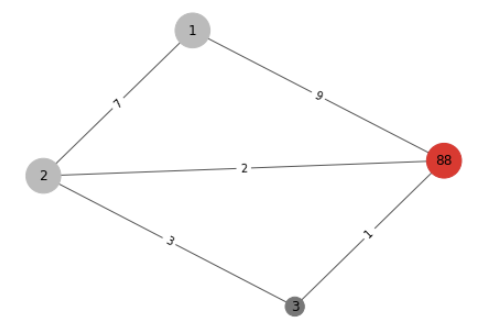

# Peking Express

## Problem description

This digital multi-player game is inspired by
the [reality TV game Peking Express](https://en.wikipedia.org/wiki/Peking_Express), where participant couples engage in
a hitchhiking race to the end destination Beijing (Peking).

You form a couple with another student and are together responsible for one character in the game. A map is given as a
graph with locations and connections, where Peking is the destination location. Also given is a budget – same for each
couple, and a start location - which is possibly different for each couple. In every turn, your character can move from
the current location to a new one, along an available connection, or can choose to wait a round in the current location.
Each move from a location to another has a cost (ticket price) associated with it. Some critical locations can only
accommodate one player at a time, which means that the location, if occupied, is temporarily unavailable.

The challenge is to design and implement an algorithm that drives the moves of your character from the start location to
Peking, in a minimal number of moves. Of course, the total amount spent on tickets for the whole route should fit in the
budget.

### Functions

For describing this function we use the following graph.



The following functionalities (endpoints) need to be implemented:

- `initializeMap (Json map)` – read the input map, which is provided in the following json structure:

```json
{
  "locations": {
    "number": 4,
    "critical": [
      3
    ]
  },
  "connections": {
    "source": [
      3,
      2,
      1,
      2,
      3
    ],
    "target": [
      2,
      1,
      88,
      88,
      88
    ],
    "price": [
      3,
      7,
      9,
      2,
      1
    ]
  }
}
```

- `setStartLocation (int startLocation)` – initialize the given start location as the initial position for your
  character.

- `updateOccupiedLocations (locationList)` – after every move, this function should update the currently occupied
  locations on your locally maintained map. This is necessary for the availability checks of the critical locations.

- `nextMove() : int` – when it is your turn to move, compute, and return the new location of your character.

### Input

The (text) test files for this assignment will have the following structure:

- `Json {...}` – the map
- `int` – the start location
- `int` – budget
- `OccupiedLocations` – a list of occupied locations per turn.

*Note*: Since the turns are simulated, the set of given occupied locations will sometimes not contain your own location.
Make sure to add that yourself. That is, in every turn, `OccupiedLocations[i] = OccupiedLocations[i] + ownLocation`. The
list starts at turn 1.

### Output

The output should be a list of locations describing your path from the start location to Peking (= location 88).

For example, the output `[1, 2, 2, 3, 88]` describes the path:

1. Start at 1.
2. Move to location 2.
3. Stayed at location 2.
4. Moved to location 3.
5. Moved to location 88.

### Strategy

Your algorithm will look like this:

```
read from input file: map, startLocation, OccupiedLocations
initMap(map)
setStartLocation(startLocation)
currentTurn = 1
path = []
while (current location is not 88)
  path += nextMove()
  execute nextMove()
  updateOccupiedLocations(OccupiedLocations[currentTurn])
print path
```

## Getting started

### Prerequisites

- Python
- Pip

### Setup

First, clone the directory.

Then, install all Python requirements.

```
pip install -r requirements.txt 
```

Start the server.

```
uvicorn main:app --reload
```

## License

This project is licensed under the [MIT](https://opensource.org/licenses/MIT) license.